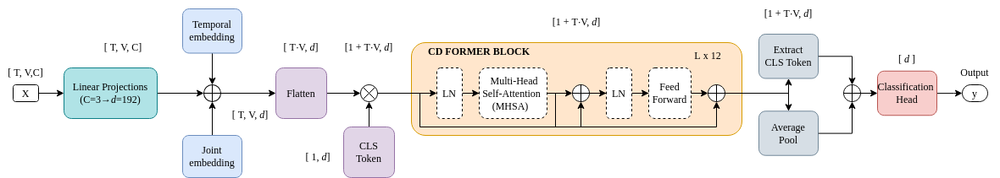
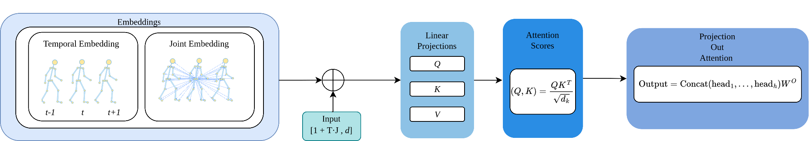
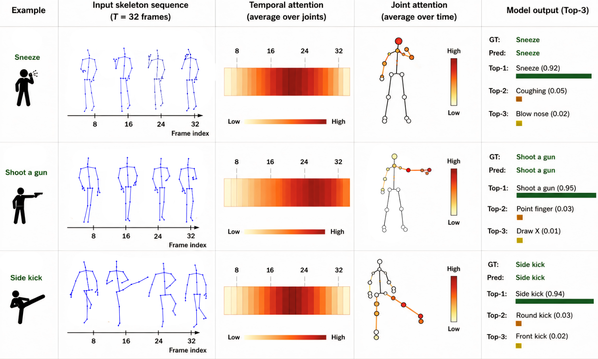
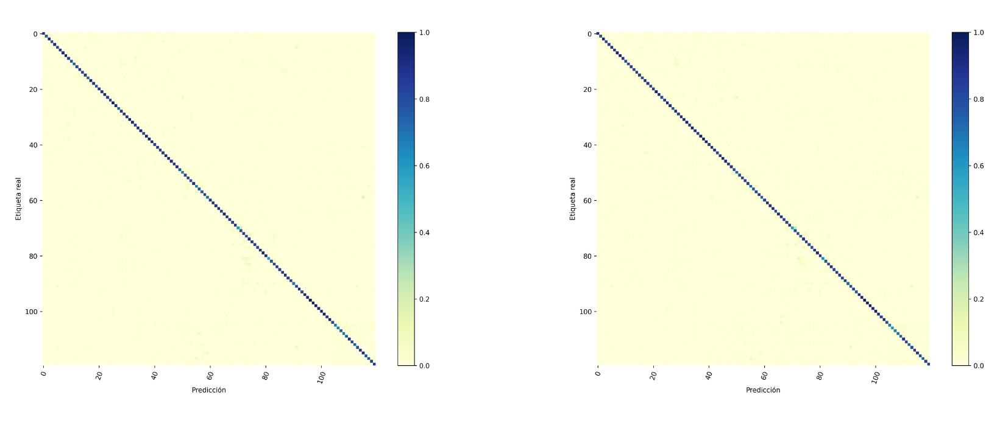
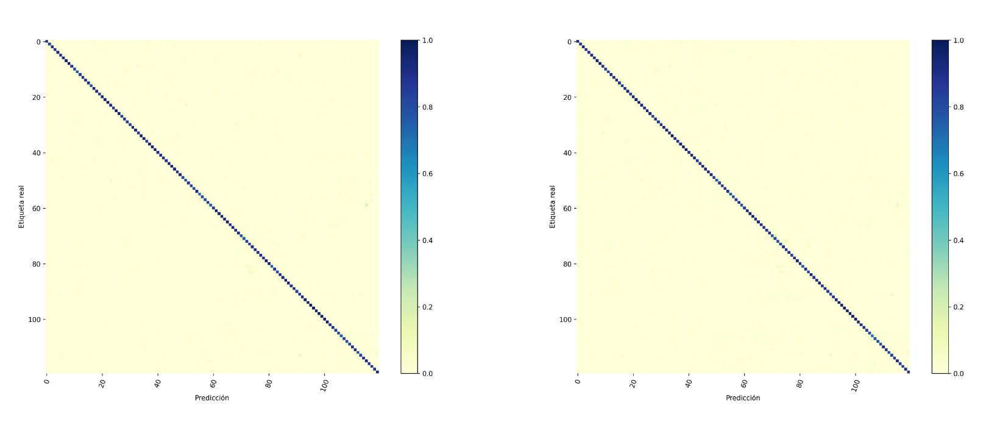
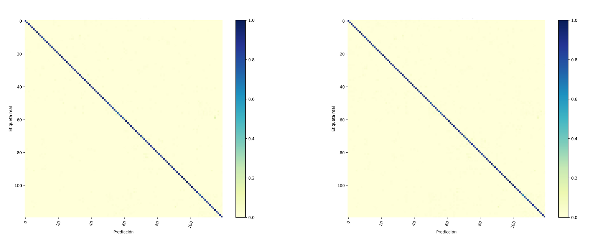

# CD-Former

<p align="center">
  <strong>Graphormer-based Human Action Recognition with spatial skeleton modeling and reset-based fine-tuning</strong>
</p>

---

## Model Architecture



CD-Former receives a skeleton sequence, projects the input features into a latent representation, adds temporal and joint embeddings, prepends a CLS token, and processes the resulting sequence through stacked CD-Former blocks. The final prediction is obtained by combining the CLS token representation with average-pooled sequence features before the classification head.

---

## Contextual Dynamic Attention



The attention module combines temporal and joint-aware embeddings before computing multi-head self-attention. This allows the model to represent both frame-level motion progression and joint-level spatial dependencies in the skeleton sequence.

---

## Qualitative Visualization



The qualitative visualization shows input skeleton sequences, temporal attention, joint attention, and top-3 action predictions generated by CD-Former.

---

## Validation Results

| 16 Frames | 24 Frames | 32 Frames |
|:---:|:---:|:---:|
|  |  |  |

---

## Overview

**CD-Former** is a Graphormer-based implementation for Human Action Recognition (HAR) using 3D skeleton data from NTU RGB+D 120. The repository includes a PyTorch evaluation pipeline for NTU120 validation splits, pretrained checkpoint loading, temporal embedding reset for different frame settings, and metric generation.

The standalone evaluation script is:

```text
graphormer_frames_reset_eval.py
```

---

## Main Features

- Graphormer-based spatial modeling for 3D skeleton sequences.
- Support for NTU RGB+D 120 xsub and xset validation splits.
- Standalone evaluation script for pretrained checkpoints.
- Configurable number of frames, embedding dimension, attention heads, and Transformer layers.
- Temporal embedding reset when evaluating a checkpoint with a different frame setting.
- Metrics: Top-1, Top-5, recall, F1, balanced accuracy, Cohen's kappa, Matthews coefficient, GFLOPs, FPS, latency, RAM/VRAM usage.
- Confusion matrices and CSV reports saved automatically.

---

## Repository Structure

```text
CD_FORMER/
├── graphormer_frames_reset_eval.py
├── README.md
├── requirements.txt
├── checkpoints/
│   └── CD_former.pth
├── scripts/
│   ├── eval_cdformer.sh
│   └── train_cdformer.sh
└── assets/
    ├── figures/
    │   ├── cdformer_architecture.png
    │   ├── contextual_dynamic_attention.png
    │   ├── cdformer_attention_examples.png
    │   ├── confusion_matrix_16f.png
    │   ├── confusion_matrix_24f.png
    │   └── confusion_matrix_32f.png
    └── videos/
        └── demo.mp4
```

Large files such as datasets are not included in the repository. The NTU120 annotation file is downloaded automatically by the evaluation script.

---

## Installation

Clone the repository:

```bash
git clone https://github.com/rombaldivia/CD_FORMER.git
cd CD_FORMER
```

Create and activate a Python environment:

```bash
python -m venv .venv
source .venv/bin/activate
```

Install dependencies:

```bash
pip install -r requirements.txt
```

---

## Dataset

The evaluation pipeline uses the NTU RGB+D 120 annotation file:

```text
ntu120_3danno.pkl
```

The script downloads it from the OpenMMLab/MMAction public resource when it is not already available:

```text
https://download.openmmlab.com/mmaction/pyskl/data/nturgbd/ntu120_3danno.pkl
```

Expected validation splits:

```text
xsub_val
xset_val
```

---

## Pretrained Checkpoint

The pretrained CD-Former checkpoint should be placed at:

```text
checkpoints/CD_former.pth
```

---

## Evaluation

Recommended full evaluation:

```bash
bash scripts/eval_cdformer.sh
```

The script evaluates 16, 24, and 32-frame settings and saves outputs under:

```text
results/metrics_eval_16f
results/metrics_eval_24f
results/metrics_eval_32f
```

To run one specific setting manually:

```bash
python graphormer_frames_reset_eval.py \
  --pkl /data/nturgbd/ntu120_3danno.pkl \
  --weights checkpoints/CD_former.pth \
  --val_xsub xsub_val \
  --val_xset xset_val \
  --frames 32 \
  --d_model 192 \
  --heads 8 \
  --layers 12 \
  --batch 32 \
  --device cpu \
  --num_workers 2 \
  --outdir results/metrics_eval_32f
```

For GPU-enabled environments, use:

```bash
DEVICE=cuda bash scripts/eval_cdformer.sh
```

---

## Code Ocean

For Code Ocean, the reproducible run can use:

```bash
bash /code/scripts/eval_cdformer.sh
```

If the checkpoint is stored directly as `/code/CD_former.pth`, run:

```bash
WEIGHTS_PATH=/code/CD_former.pth CODE_DIR=/code RESULTS_DIR=/results bash /code/scripts/eval_cdformer.sh
```

The recommended Code Ocean post-install dependencies are the same as `requirements.txt`, plus `wget` for downloading the NTU120 annotation file.

---

## Demo Video

The demo video is included in the repository:

[View demo video](assets/videos/demo.mp4)

GitHub README pages usually render images directly, but video files are more reliable as a repository file link.

---

## Reproducibility Notes

Default evaluation settings:

```text
d_model  = 192
heads    = 8
layers   = 12
frames   = 16, 24, 32
device   = cpu by default, cuda optional
```

---

## Citation

If this repository is useful for your research, please cite the accompanying manuscript:

```bibtex
@article{baldivia2026cdformer,
  title={CD-Former},
  author={Baldivia Calderon de la Barca, Romel Antonio and others},
  year={2026},
  note={Manuscript under review}
}
```

---

## License

This repository is licensed for noncommercial academic and research use. Commercial use requires a separate written license agreement with the author. See `LICENSE` and `COMMERCIAL.md` for details.
